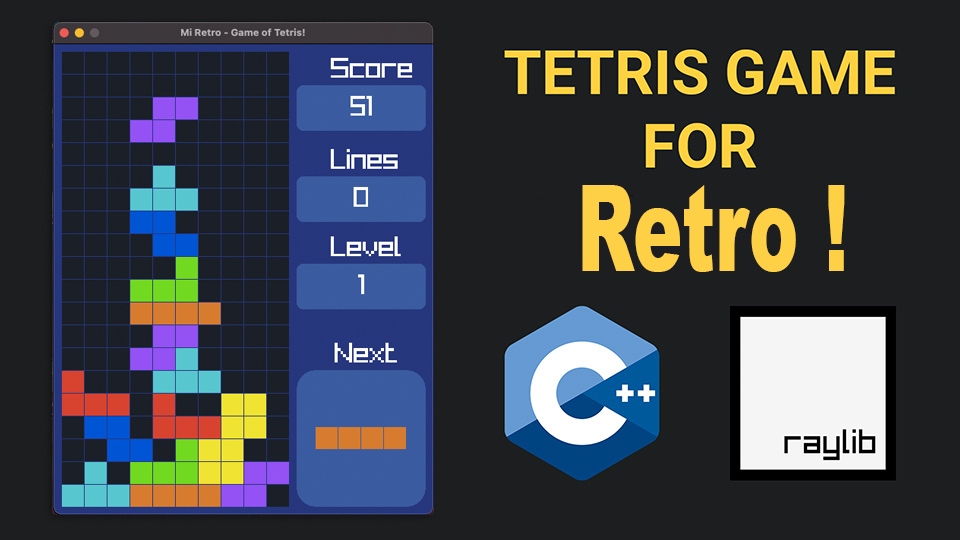

```plaintext

████████╗███████╗████████╗██████╗ ██╗███████╗
╚══██╔══╝██╔════╝╚══██╔══╝██╔══██╗██║██╔════╝
   ██║   █████╗     ██║   ██████╔╝██║███████╗
   ██║   ██╔══╝     ██║   ██╔══██╗██║╚════██║
   ██║   ███████╗   ██║   ██║  ██║██║███████║
   ╚═╝   ╚══════╝   ╚═╝   ╚═╝  ╚═╝╚═╝╚══════╝                                
```

# Juego Retro de Tetris en C++ usando Raylib

🕹️🐍🎮 Este repositorio de GitHub alberga el código fuente completo de un juego del famoso Tetris, que diseñado y programado por Alekséi Pázhitnov en la Unión Soviética. Se publicó el 6 de junio de 1984, mientras trabajaba para el Centro de Computación Dorodnitsyn de la Academia de Ciencias de la Unión Soviética en Moscú. La musica original del juego se llama el tema "Korobeiniki".

Esta version simple esta creada con el lenguaje de programación C++ y la biblioteca Raylib. 💻🎨🎧

El juego utiliza varias funciones de raylib para el manejo de gráficos, manejo de entrada y audio y se puede jugar en computadoras con Sistema operativos de macOS, Linux y Windows. 🔍📖 El código está bien estructurado y es fácil de leer, se han ido poniendo comentarios, y otros comentarios en el avance y mejoras que se han ido, lo que lo convierte en un recurso valioso para los aspirantes a desarrolladores de juegos que buscan aprender sobre la programación de juegos con la libreria raylib.

Si quieres aprender a crear tu propio juego, consulta este juego a través de cada línea de código, explicando la lógica detrás de ella y demostrando cómo afecta al juego. Descubrirás cómo configurar la ventana del juego, crear la cuadrícula y las clases de bloques, agregar detección de colisiones e implementar efectos de sonido.

Al final, tendrás un juego de Tetris completamente funcional que podrás jugar y modificar como quieras.

☕ Entonces, ¡toma una taza de café y sumergámonos en el apasionante mundo del desarrollo de juegos! 🚀

El temario de los pasos que se han ido haciendo son los siguientes:

 1. Setup the Game Loop
 2. Crating the Grid
 3. Create the blocks
 4. Move the blocks
 5. Rotate the blocks
 6. Checking for collisions
 7. Check for completed rows
 8. Game Over
 9. Create User Interface
10. Add Score
11. Add Next Block
12. Add Sounds

Los sonidos son de tipo libre, ya que los originales del juego tienen CopyRight. Hemos intentando usar versiones muy parecidas a los originales.

## Características

# Enlaces de Interes

<p align="center">
  
</p>
<br>
<br>
<p align="center">
| 📺 <a href="https://nvarona.x10.bz/">My Web Personal Channel</a>
| 🌍 <a href="https://nvarona.x10.bz/blog">My Blog Website</a> | 2024 |<br>
</p>

## Cómo ejecutar el programa

Comenzar con el juego es sencillo. Después de clonar el repositorio y configurar su entorno como se describe en el archivo README, estará listo para iniciar el juego. Aquí está tu guía para controlar e interactuar con el Juego de Tetris:

- **Iniciar el Juego**: Presione `Enter` para iniciar la partida.
- **Tecla Left**: Pulsa la tecla `LEFT` para mover el bloque a la izquierda.
- **Tecla Right**: Pulsa la tecla `RIGHT` para mover el bloque a la derecha.
- **Tecla Down**: Pulsa la tecla `DOWN` para bajar hasta el final la pieza.
- **Tecla Up**: Pulsa la tecla `UP` para rotar la pieza a gusto del usuario.
- **Tecla Drop**: Pulsa la `barra espaciadora` para bajar el bloque hasta el final.
- **Pausar/Detener**: Pulsa la tecla `P / ESC` para pausar o acabar el juego.

- **Ajustar velocidad del Juego**:
   - Aumenta el ritmo presionando `F`, haciendo que vaya más rápido.
   - Reduzca la velocidad con `S`, que le brinda una velicidad mas lenta.

## Reglas del Juego Tetris

Aquí hay algunas pautas generales sobre cómo suelen funcionar los niveles de Tetris:

Algunas reglas del juego original de Tetris, que se lanzó en 1984:
- El tablero de juego es un rectángulo de 10 celdas de ancho y 20 celdas de alto.
- Hay 7 piezas diferentes (también conocidas como Tetriminos) cada una compuesta por 4 bloques.
- Los Tetriminos caen del topo de la pantalla y el jugador puede moverlos horizontalmente y rotarlos.
- Cuando una pieza toca el fondo del tablero, se fija en su lugar y se genera una nueva pieza en la parte superior.
- Si una línea completa se llena con bloques, se elimina y se recompensa con puntos.
- Si el tablero se llena hasta el tope y no queda espacio para que caigan nuevas piezas, el juego termina.

En las primeras versiones de Tetris, no había límite de niveles. La velocidad de caída de las piezas aumenta cada cierto número de líneas completadas, haciendo que el juego sea más difícil a medida que avanza.

Aquí hay una tabla de equivalencia aproximada que podrías utilizar como referencia en tu implementación del juego:

| Nivel | Líneas eliminadas|
|-------|------------------|
| 1     | 0-9              |
| 2     | 10-19            |
| 3     | 20-29            |
| 4     | 30-39            |
| 5     | 40-49            |
| 6     | 50-59            |
| 7     | 60-69            |
| 8     | 70-79            |
| 9     | 80-89            |
| 10    | 90-99            |
| 11+   | Cada 10 líneas   |
|-------|------------------|

Recuerda que esta tabla es solo una aproximación y que puedes ajustar los valores para adaptarlos a tus necesidades y al tipo de juego que estés desarrollando. Además, puedes introducir niveles más altos o un límite para la velocidad máxima si lo consideras necesario.

- Velocidad de caída de las piezas: A medida que avanzas de nivel, las piezas tienden a caer más rápido. Esto hace que sea más difícil colocarlas estratégicamente antes de que lleguen al fondo.

Incremento de la velocidad: Cada nivel suele tener una velocidad de caída base para las piezas. Con cada nivel sucesivo, esta velocidad base puede incrementarse, haciendo que las piezas caigan más rápido desde el principio.

## Tabla de puntos:

En la versión original del Tetris, lanzada en 1984-1985, las puntuaciones eran diferentes y pueden variar ligeramente entre las diversas versiones y plataformas en las que se lanzó el juego. Sin embargo, aquí hay una tabla de puntuaciones típica que se usaba en muchas versiones tempranas del Tetris:

1 línea:  40 puntos
2 líneas: 100 puntos
3 líneas: 300 puntos
4 líneas (Tetris): 800 puntos, existe unas versiones de 1200 puntos

## Features

Algunas de las mejoras que quiero que se incluyan:

- Menu: Crear pantalla de inicio, con ayuda y caratula.
- Tabla de records: Poder intriducir iniciales del jugador y ver los records en pantalla.
- Preferencias: poder activar o descativar funcionalidades o otros parametros
- Otros variantes del juego Tetris.
